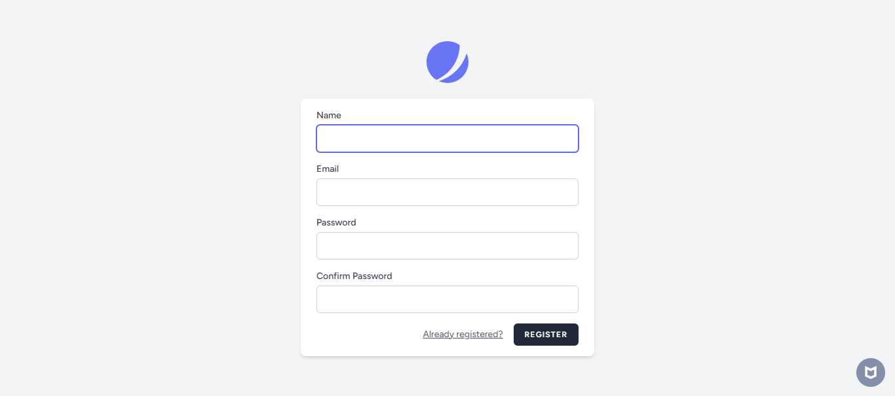

## Tentang Project Tailwind
Project Tailwind adalah sebuah aplikasi website yang dibuat oleh studentday programming web SMA Plus PGRI Cibinong.
 
 
## Dibuat Dengan :

## Project Ini Berisi Konten :

- ### Tampilan Dashboard    
    

- ### View yang Berisi Data (CRUD)    
  

- ### Menu Registrasi dan Login   
  
    

## Lisensi

Copyright (c) 2025 [Zaidan Pasya Rusmiadi](https://www.instagram.com/zai.p_/profilecard/)

